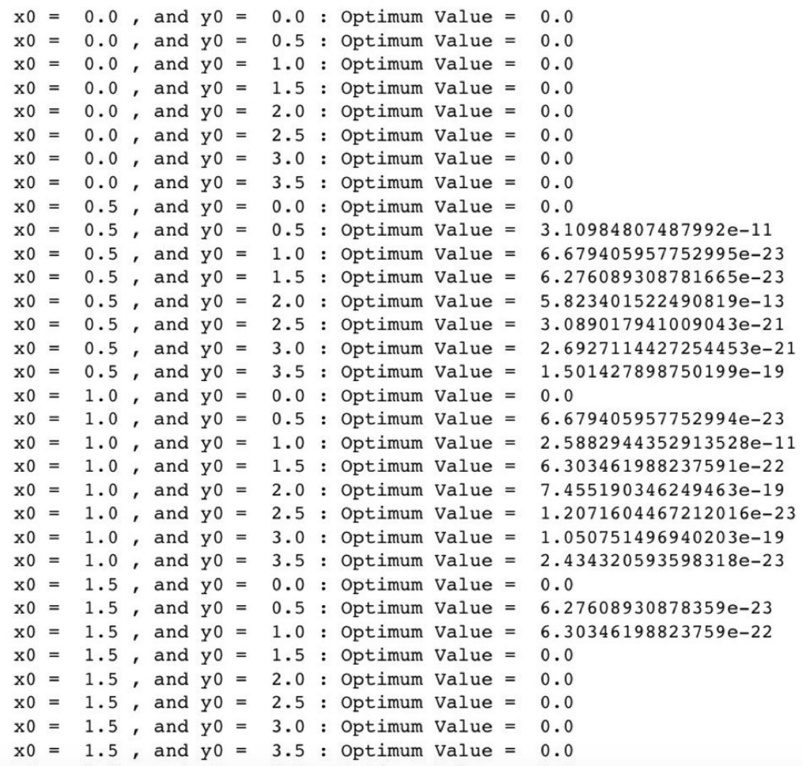
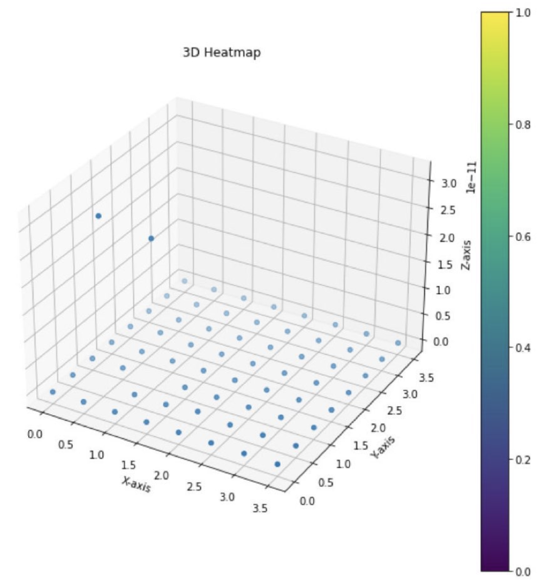
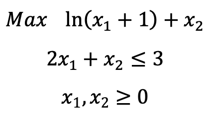
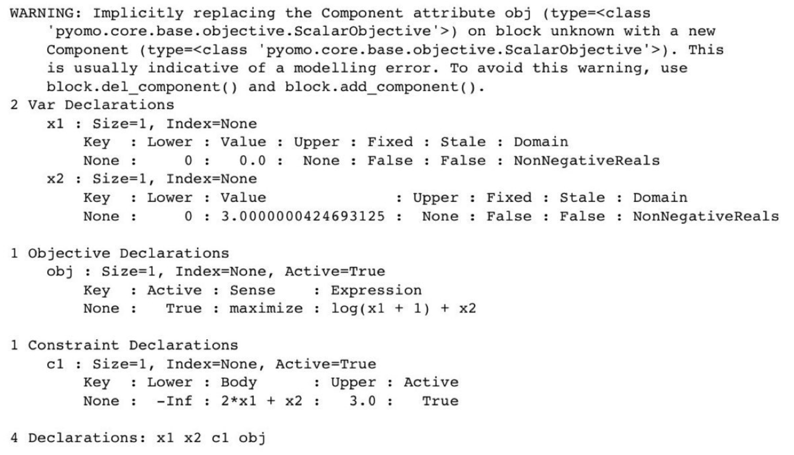
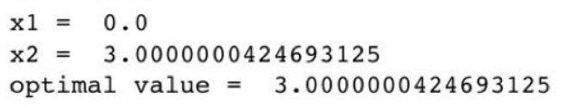
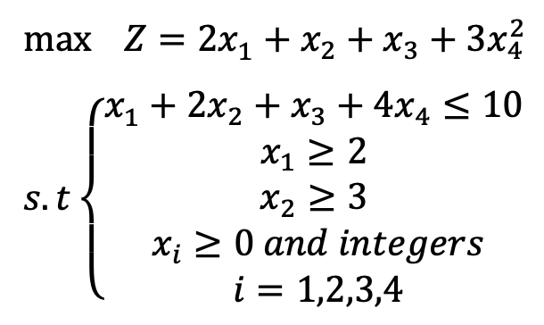
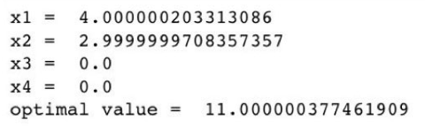

# Optimization with Non-linear Programming
some projects with the non linear programming

# Problem 1:

### Nonlinear Optimization with IPOPT


This repository contains a project that uses IPOPT, a nonlinear optimization solver, to find the optimal minimum of the function:

$$ f(x, y) = (2 - \cos(\pi x) - \cos(\pi y)) x^2 y^2 $$

We explore the effect of initial point selection on the results by solving the function for pairs of initial values $(t_{\text{ini}x}, t_{\text{ini}y})$ within the range $(0, 4)$.


The results are as below:




Plotting the results in a 3D heat map:





As it can be seen, different initial values result in different final objective values. Most of these final values are either 0, or very close to 0. Although as it can be seen for 2 data points, the minimum functio is about 10 times greater than the other ones, which is due to the computational complexities that occur because of the initial value.


# Problem 2:

### Nonlinear Optimization with Pyomo

In this project, we find the optimal solution to the following problem using the Pyomo library:





The results are as below:







As it can be seen from the question, the J function is a concavefunction (logarithmic), and the term is 'Maximize'. Also, the constraints are linear, so the feasible set is a convex set. Therefore, the problem is a convex optimization problem, and we know that the convex optimization problems have exactly one solution (their local optimum is their global optimum).


# Problem 3:

### Nonlinear Optimization with Pyomo

In this project, we find the optimal solution to the following problem using the Pyomo library:




Same as the previous problem, we model the problem like this:

```python
model = pyo.ConcreteModel()

model.x1 = pyo.Var(domain=pyo.NonNegativeIntegers)
model.x2 = pyo.Var(domain=pyo.NonNegativeIntegers)
model.x3 = pyo.Var(domain=pyo.NonNegativeIntegers)
model.x4 = pyo.Var(domain=pyo.NonNegativeIntegers)

model.c1 = pyo.Constraint(expr=model.x1 + 2*model.x2 + model.x3 + 4*model.x4 <= 10)
model.c2 = pyo.Constraint(expr=model.x2 >= 3)
```

The results are as below:



